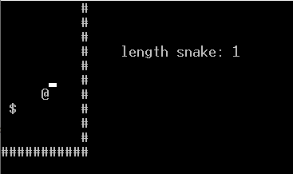
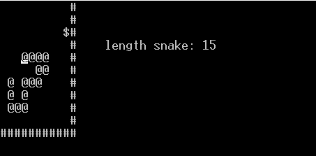

# Snake

## !!! This game only works on Windows !!!

## How to run the game?

`g++` must be installed on your computer to run the game! \
official GCC [website](https://gcc.gnu.org/)  there you can download `g++`

Running game in 2 steps:\
1. open comand line in floder for game
2. Enter next commands:\
if you have git in command line:
    ```
    git clone https://github.com/protosevichVlad/Snake.git
    ```
    otherwise download ZIP archive and unzip to this folder\
    after:
    ```
    g++ main.cpp field.cpp game.cpp snake.cpp -o snake
    ```

3. Run file with name `snake.exe`
4. Enjoy)

## Screenshots






